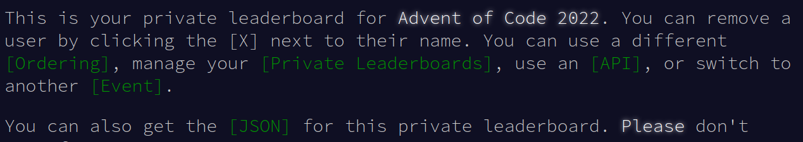

# Advent of Code Google Chat
This script sends Advent of Code leaderboard information to a Google Chat space.

<p align="center"></p>

## How it works
The script saves the current leaderboard in a `saved.json` file on GitHub. Every 15 minutes, the script uses the Advent of Code API to retrieve the updated leaderboard. 
If the leaderboard has changed, the script saves the updated leaderboard to GitHub and sends a message with the updated leaderboard to the Google Chat space.

## Getting started
To use this script, click the `Use this template` button and set up the required GitHub environment variables. 
You can set up the environment variables by going to the  `⚙️ Settings > Secrets` section of your project repository.

## Setting environment variables
Before running the script, you need to set the following environment variables:

```bash
export sessionCookie="YOUR_SESSION_COOKIE"
export googleChatUrl="YOUR_GOOGLE_CHAT_URL"
export leaderboardUrl="YOUR_LEADERBOARD_URL"
```
- `sessionCookie` can be retrieved by visiting the Advent of Code page and using your browser's developer tools to inspect the cookies associated with the page.

- `googleChatUrl` should look something like https://chat.googleapis.com/v1/spaces/AAAAoYQLvw0/messages?key=YOUR_KEY&token=YOUR_TOKEN. You can get it from the Google Chat space by following the instructions [here](https://developers.google.com/chat/how-tos/webhooks#create_a_webhook).

- `leaderboardUrl` can be retrieved from the Advent of Code private leaderboard view, by clicking on `[API]` and then `[JSON]`.
<p align="center"></p>

## Running the script
Once you have set the environment variables, you can run the script using the following command:

```bash
go run aoc.go
```
